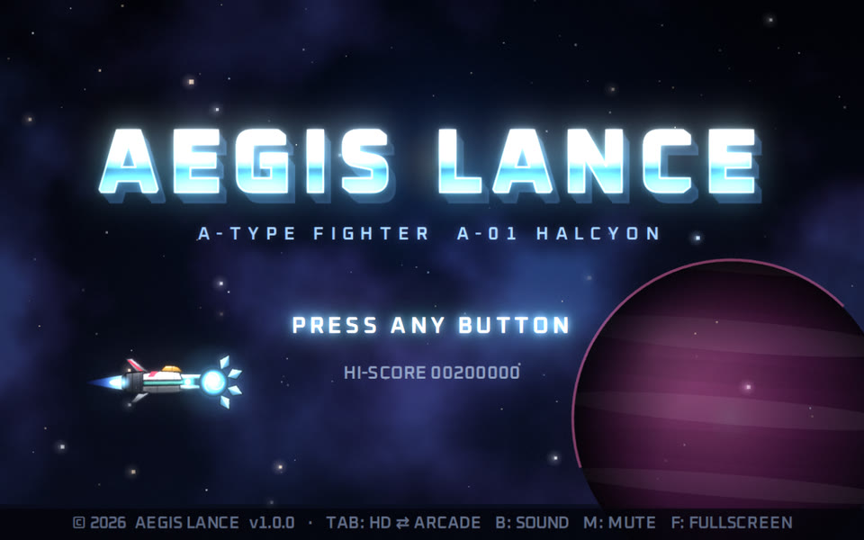
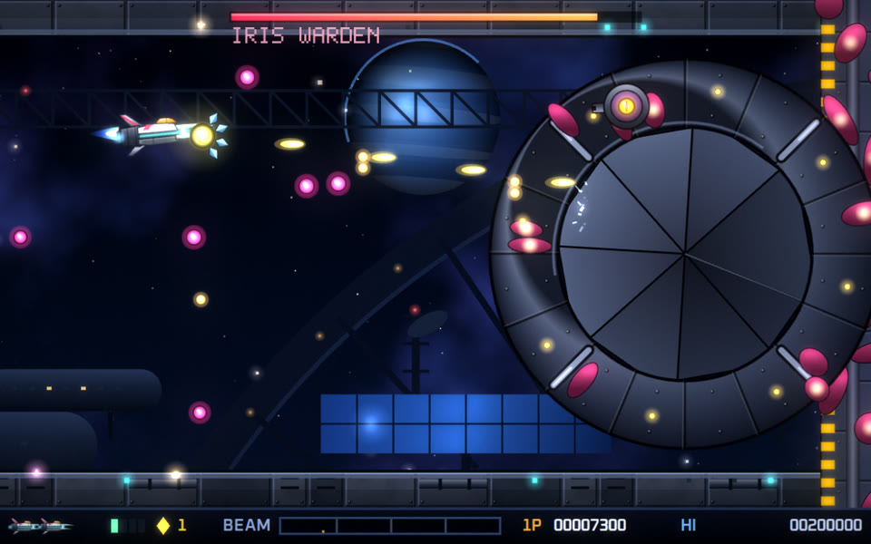
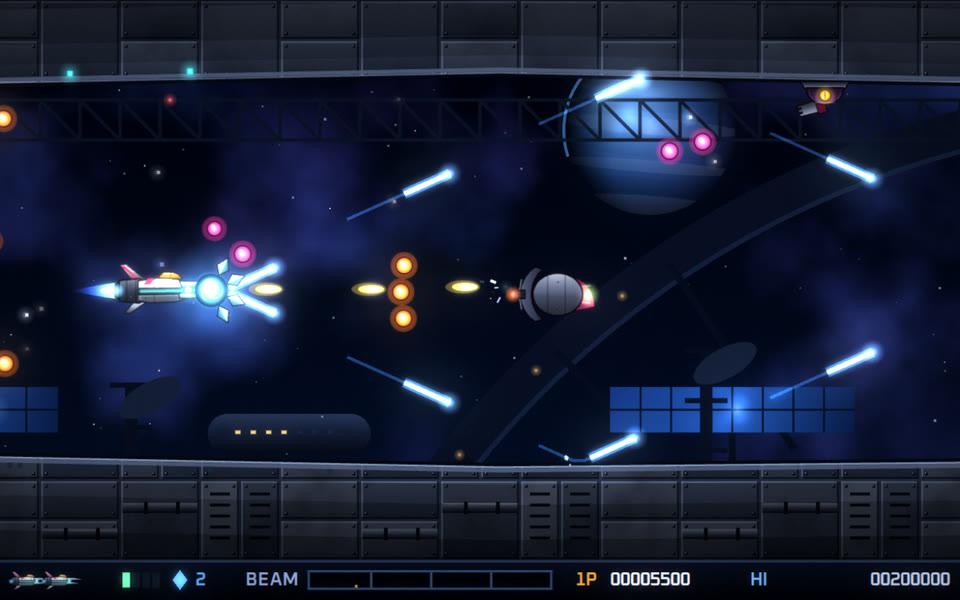
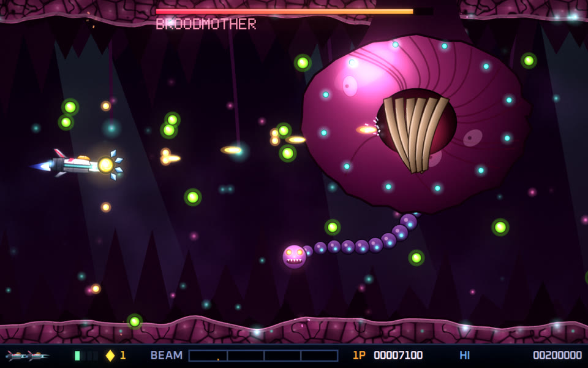
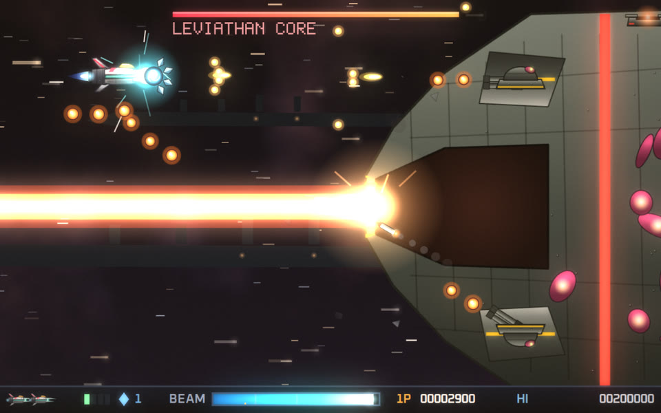
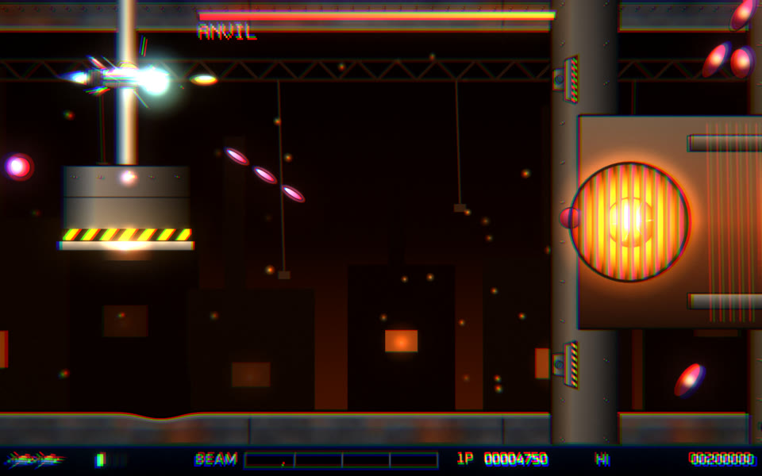
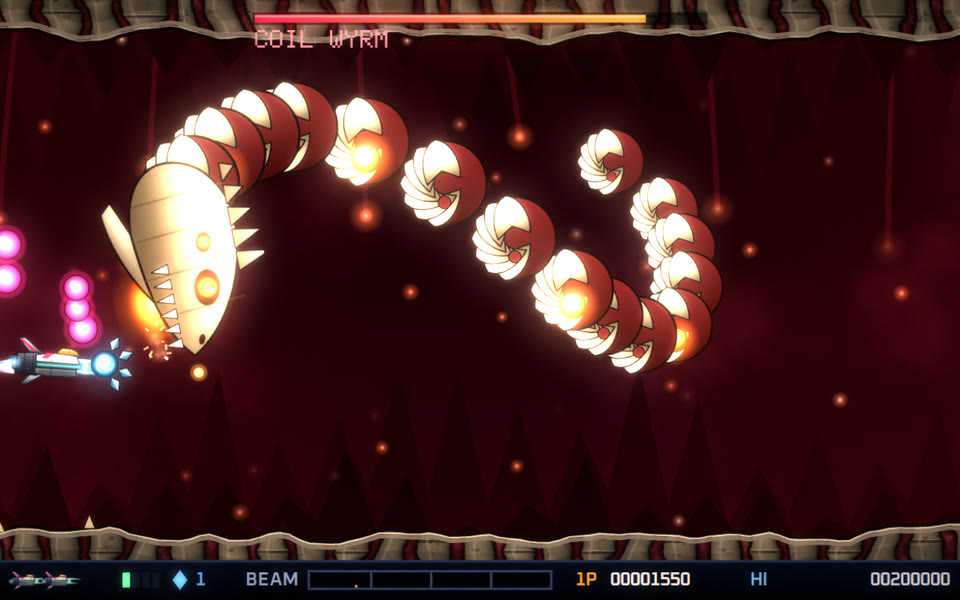
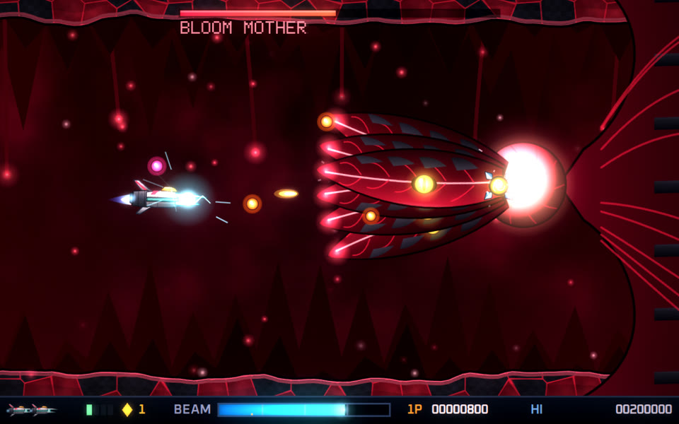
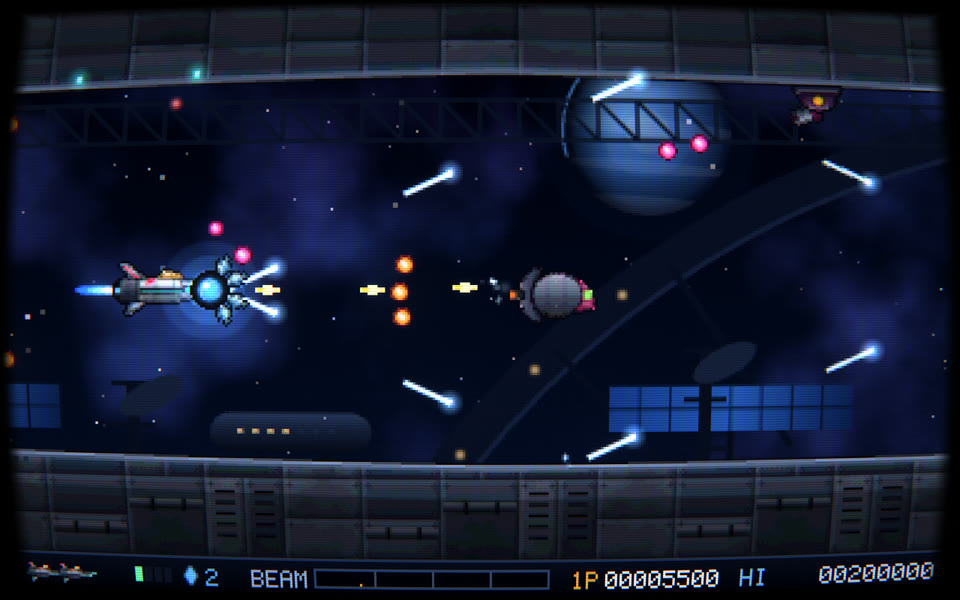

# AEGIS LANCE（イージス・ランス）

**80年代末のアーケード横スクロールシューティングの金字塔、そのルールをできる限り忠実に再現し、
キャラクター・敵・ステージ・BGM・効果音はすべて新規に作り起こした、ブラウザーで動く横スクロールSTGです。**

溜め撃ちの貫通ビーム、無敵で着脱できる球体ポッド、3色のレーザー、一撃死、地形接触死、チェックポイント復帰、
1ステージ丸ごと巨大戦艦、生体の洞窟、そしてポッドでしか倒せない最終ボス。
原作のゲームデザインを土台に、HD／アーケードの画質切替、WebGL ポストエフェクト、2系統のシンセ音源、
日本語・英語、ゲームパッド・タッチ操作など、現代の機能を足しています。



## 遊び方（すぐ遊ぶ）

- **`dist/index.html` をダウンロードしてダブルクリック**するだけで遊べます（1ファイル・約380KB・インストール不要・サーバー不要）。
- GitHub Pages で公開すると URL を開くだけで遊べます（手順は[下記](#github-pages-で公開する)）。
- 推奨: PC の Chrome / Edge / Firefox / Safari の最新版。スマートフォンは横持ちでタッチ操作に対応しています。
- 音はブラウザーの仕様上、最初のキー入力またはタップのあとに鳴り始めます。

## スクリーンショット

| | |
| --- | --- |
|  ステージ1 ボス「IRIS WARDEN」 |  青クリスタルの反射レーザー〈PRISM〉 |
|  ステージ2 ボス「BROODMOTHER」 |  ステージ3 巨大戦艦のコアと主砲 |
|  ステージ4 ボス「ANVIL」 |  ステージ5 ボス「COIL WYRM」 |
|  最終ボス「BLOOM MOTHER」 |  ARCADE 1987 表示（ドット絵＋CRT） |

## 操作方法

| 操作 | キーボード | ゲームパッド | タッチ |
| --- | --- | --- | --- |
| 移動 | 矢印キー / WASD | 左スティック / 十字キー | 左側の仮想スティック |
| ショット | Z / Space / J（短く押す） | A | FIRE |
| 溜め撃ち〈ランス〉 | Z を押し続けて離す | A を押し続けて離す | FIRE を押し続けて離す |
| イージス 射出／回収 | X / K | B | POD |
| 連射（溜めない） | C / L（押している間） | X | RAPID |
| スピード切替 | Shift / V | Y / RB | – |
| ポーズ | Esc / P / Enter | Start | II |
| 表示切替 HD ⇄ ARCADE | Tab / G | Back（Select） | – |
| 音源切替 | B | – | – |
| ミュート | M | – | – |
| フルスクリーン | F | – | – |

## ルール（原作の再現ポイント）

| 原作の仕組み | 本作での再現 |
| --- | --- |
| 溜め撃ちの波動ビーム | 〈ランス〉。押し続けると画面下の BEAM メーターが 5 段階で溜まり、離すと敵を貫通するビーム。最大溜めは白く点滅し、編隊ごと貫く。溜め中も小さな弾が自動で出る |
| 着脱式の無敵ポッド | 〈イージス〉。無敵で、通常弾を吸収し、触れた敵を削る。機首で触れれば前、尾部で触れれば後ろに装着。射出して体当たりさせ、もう一度押すと呼び戻せる。地形をすり抜ける |
| 3 色のレーザー | クリスタルは 赤→青→黄 と周期的に色が変わり、取った色でレーザーが決まる。赤 HELIX（前方へ螺旋・貫通）、青 PRISM（斜め・壁で反射）、黄 CRAWLER（床や天井を這う）。重ねて取ると Lv3 まで成長 |
| ビット・ミサイル | 上下を守る衛星ビット（最大 2 機）、追尾ミサイル（最大 Lv2） |
| スピードアップ | S アイテムで最高速度が 4 段階まで上がり、Shift で好きな速度に切り替えられる |
| 一撃死 | 被弾・敵との接触・地形への衝突は即ミス。弾の当たり判定はコクピット付近だけ、地形には機体全体が当たる |
| チェックポイント復帰 | ミスすると直前のチェックポイントから、装備を失って再開。復帰後まもなくイージスを運ぶキャリアが飛来する |
| ボスの弱点 | ボスの装甲はビームもイージスも通さない。開閉する光る弱点を狙う |
| 最終ボス | 核はイージスでしか傷つかない。花弁が開いた瞬間にイージスを撃ち込むと、閉じるまで核に食い込んで削り続ける |
| コンティニュー | スコアの下 1 桁にコンティニュー回数が刻まれる |
| エクステンド | 50,000 点・150,000 点、以降 150,000 点ごとに 1 機 |
| ステージ構成 | 宇宙要塞 → 生体洞窟 → 1 ステージ丸ごと巨大戦艦 → 兵器工場 → 骨の回廊 → 心臓部 の全 6 ステージ |

本作独自の追加ルールとして、1 発のランスで複数の敵を倒すと **CHAIN ボーナス**、ボスを倒すと画面の敵弾が得点ジェムに変わります。

### アイテム

| アイテム | 効果 |
| --- | --- |
| クリスタル（赤・青・黄） | 最初の 1 個でイージスが飛来。以降は色に応じたレーザーに切り替わり、レベルが上がる |
| S | スピードアップ（最高 4 段階） |
| M | 追尾ミサイル |
| B | 衛星ビット |

アイテムは、編隊の中を飛ぶキャリアや地上を歩くキャリアを倒すと出てきます。

### ステージとボス

| # | ステージ | 舞台 | 中ボス | ボス |
| --- | --- | --- | --- | --- |
| 1 | DERELICT GATE（朽ちた関門） | 宇宙ステーション | SENTINEL | IRIS WARDEN（虹彩の門番） |
| 2 | VERDANT ABYSS（翠の深淵） | 生体の洞窟 | MANTIS | BROODMOTHER（孕む母胎） |
| 3 | IRON LEVIATHAN（鉄の巨鯨） | 1 隻の巨大戦艦 | COMMAND TOWER | LEVIATHAN CORE（巨鯨の核） |
| 4 | FOUNDRY（鋳造炉） | 兵器工場（プレス機・ブロック迷路） | ASSEMBLER | ANVIL（鉄鎚） |
| 5 | SERPENT'S COIL（大蛇の螺旋） | 蠕動する骨の回廊 | WYRM TAIL | COIL WYRM（螺旋竜） |
| 6 | THE HEART（心臓） | ブルームの心臓部 | VALVE GUARDIAN | BLOOM MOTHER（ブルームの母） |

### 難易度

| 難易度 | 内容 |
| --- | --- |
| CASUAL | 残機 5、弾が遅く少ない、ミスしてもイージス（Lv1）を保持 |
| ARCADE | 原作どおり。残機 3、チェックポイント復帰、ミスで装備をすべて失う |
| VETERAN | 弾が速く多く、倒した敵が撃ち返してくる |

## 現代的なアレンジ

- **HD REMASTER ⇄ ARCADE 1987 の表示をプレイ中でも一瞬で切替**（Tab）。HD はベクター描画のスプライトを画面解像度で描き、ARCADE は 1 倍のドット絵（RGB 各 4bit＝4096 色に量子化し、輪郭線を付加）に CRT フィルターをかけます。
- **WebGL ポストエフェクト**: 2 段のブルーム、爆発の衝撃波で画面が歪むディストーション、色収差、CRT（走査線・湾曲・シャドウマスク）、カラーグレーディング、ビネット、フィルムグレイン。WebGL が使えない環境では 2D 描画で動きます。
- **2 系統の音源をリアルタイム切替**（B）: REMASTERED（スーパーソウ・フィルター・リバーブ・ディレイ）と ARCADE FM（2 オペレーター FM 音源＋粗い PCM ドラム）。
- **全 14 曲のオリジナル BGM** を MML で作曲し、Web Audio で演奏時に合成。効果音もすべてその場で合成しています（音声ファイルは 0 個）。
- 画像ファイルも 0 個。自機・敵・ボス・背景・地形テクスチャ・爆発はすべてコードで描いています。
- ヒットストップ、スロー演出、画面の揺れ、ゲームパッドの振動。
- プロローグ、エンディング（スタッフロールと敵の図鑑）、ハイスコアとネームエントリー、ステージセレクト（練習モード・残機無限）、ミュージックルーム、遊び方、デモプレイ。
- 日本語／英語、キーボード／ゲームパッド／タッチ、タブを切り替えると自動ポーズ。
- 設定・ハイスコア・到達ステージはブラウザーに保存されます。

## 権利について

- 本作は、80 年代末のアーケード横スクロールシューティングのゲームルール（仕組み）を参考にした**非公式のファン作品**です。
  キャラクター、名称、グラフィック、音楽、効果音、ストーリーはすべて新規に制作したもので、既存作品の画像・音声・コード・データは一切使用していません。
- 「R-TYPE」は各権利者の商標です。本作は権利者とは関係がありません。
- フォント: [Oxanium](https://fonts.google.com/specimen/Oxanium)（SIL Open Font License 1.1、`src/fonts/` に同梱）、
  [DotGothic16](https://fonts.google.com/specimen/DotGothic16)・[Zen Kaku Gothic New](https://fonts.google.com/specimen/Zen+Kaku+Gothic+New)（SIL OFL、Google Fonts から読み込み。オフラインでは代替フォントで表示）。

## 開発

必要なもの: Node.js 20 以上。

```bash
npm install          # esbuild と Playwright（テスト用）
npm run dev          # http://localhost:8123/ で起動（src/ を編集して再読み込みするだけ）
npm run build        # dist/index.html（単一ファイル版）と dist/artifact.html を生成
npm test             # 単体テスト（BGM データ、ステージ定義と敵の登録、フォント、ノイズ、乱数）
npm run e2e          # E2E（別ターミナルで npm run dev を起動しておく）
```

E2E はヘッドレス Chromium の中で、無敵のボットが全 6 ステージを個別にクリアし、ステージ 1 からエンディングまで通しでプレイし、
すべてのメニュー画面を HD／ARCADE・日本語／英語で開いてエラーがないことを確かめます（Playwright のブラウザーが必要です: `npx playwright install chromium`）。

### URL パラメーター（検証・共有用）

| パラメーター | 例 | 内容 |
| --- | --- | --- |
| `stage` / `cp` | `?stage=3&cp=2` | ステージ 3 のチェックポイント 2 から開始 |
| `diff` | `?diff=2` | 難易度（0 CASUAL / 1 ARCADE / 2 VETERAN） |
| `mode` | `?mode=arcade` | 表示（`hd` / `arcade`） |
| `kit` | `?kit=arcade` | 音源（`remastered` / `arcade`） |
| `lang` | `?lang=en` | 言語（`ja` / `en`） |
| `crt` | `?crt=0` | CRT フィルターのオン／オフ |
| `scene` | `?scene=music` | 画面を直接開く（`menu` `options` `music` `records` `howto` `credits` `stages` `difficulty` `prologue` `demo` `ending`） |
| `god` / `bot` | `?stage=1&god=1&bot=1` | 無敵／自動操縦（テスト用） |
| `frames` / `until` | `&frames=70000&until=clear` | 指定フレームを同期実行して結果を `document.body.dataset.report` に出力（`until`: `clear` `boss` `ending`） |

### ディレクトリ構成

```
index.html            開発用エントリー（npm run dev）
dist/index.html       単一ファイル版（ビルド成果物。これだけで遊べる）
src/
  main.js             起動、60Hz 固定ステップのメインループ
  config.js           画面サイズ、難易度、エクステンドなどの定数
  core/               入力（キーボード・パッド・タッチ）、数学、乱数、保存
  gfx/                レンダラー、WebGL ポストエフェクト、スプライト、テクスチャ、フォント、パーティクル
  gfx/art/            自機・敵・ボス・エフェクト・ロゴの手続き描画
  audio/              シンセ、2 系統の音源、MML コンパイラー、シーケンサー、効果音
  audio/songs/        全 14 曲の譜面
  game/               ワールド、自機、イージス、武器、敵、弾、地形、背景、HUD、ボット
  game/enemies/       ステージごとの敵
  game/bosses/        6 体のボス
  game/stages/        6 ステージのタイムライン（地形・敵配置・チェックポイント）
  ui/                 タイトル、メニュー、プレイ画面、エンディング、文言（日英）
tests/unit/           単体テスト（node --test）
tests/e2e/            E2E（Playwright）
tools/                ビルド、開発サーバー、スクリーンショット、音声チェック
docs/                 設計メモとスクリーンショット
```

設計の詳細は [docs/DESIGN.md](docs/DESIGN.md) を参照してください。

## GitHub Pages で公開する

1. このブランチを `main` にマージします。
2. リポジトリの **Settings → Pages → Build and deployment → Source** を **GitHub Actions** にします。
3. `main` に push されるたびに `.github/workflows/pages.yml` が単体テスト・ビルド・E2E を実行し、成功すると `dist/index.html` が公開されます
   （Actions タブの「Run workflow」から手動でも実行できます）。
4. 公開 URL は `https://<ユーザー名>.github.io/<リポジトリ名>/` です。
